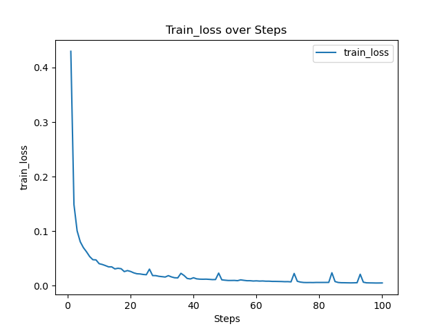
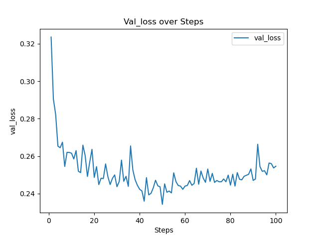
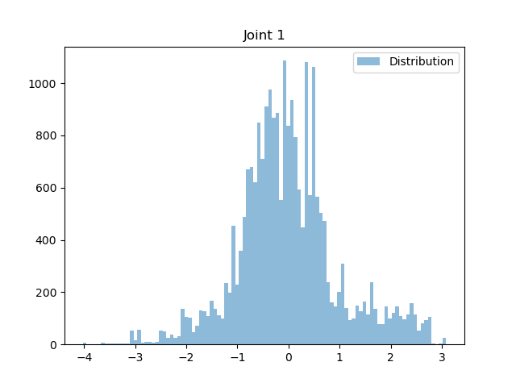
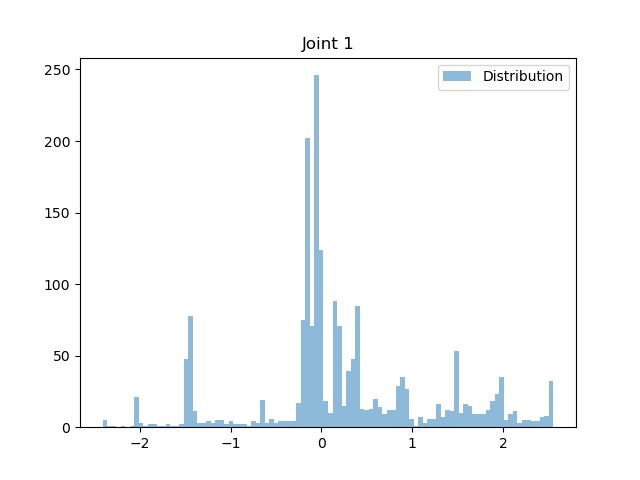

<p align="center">
  <a href="https://www.virtualincision.com/">
    
  </a>
</p>

# Surgical Robot Imitation Learning

Needle pick-and-hand-off on a dual-arm surgical robot using imitation learning. This repo contains a simple training engine (ClassicIL), a dataset pipeline, and an ACT-style policy for predicting future joint trajectories from video frames. The policy was deployed for real-time inference on an NVIDIA Holoscan pipeline during my internship at Virtual Incision.

## Internship Context & Highlights

- Organization: [Virtual Incision](https://www.virtualincision.com/) — surgical robotics R&D.
- Device: Dual-arm surgical robot performing needle pick-and-hand-off.
- Deployment: Real-time, on-device inference on NVIDIA Holoscan.
- Model: ACT-style policy predicting short joint trajectories from RGB frames.
- Data: Synchronized video frames and robot joint logs via this repo’s dataset tools.
- Demo: Closed-loop control achieving reliable pick-and-hand-off (see video below).

## Demo

<video controls src="Archive/documentation/Needle_pick_handoff.MP4" width="720"></video>

[Watch the hand-off demo (MP4)](Archive/documentation/Needle_pick_handoff.MP4)

- Classic imitation learning engine with train/resume/visualize/export modes.
- ACT-style model predicting short action sequences from images.
- Dataset tools to extract frames from video and align robot logs.

## Setup Photos

Photos of the robot environment and the teleoperation device used during development. Replace the placeholder image paths with your own files.

<p align="center">
  
  
</p>

## Quickstart

1) Environment (Python 3.10+):

```
pip install torch torchvision
pip install numpy pandas pyyaml matplotlib albumentations opencv-python av colorama
```

2) Configure data paths in `source/configs/act_il.yaml` (`train_data_path`, `val_data_path`).

3) Train / Visualize / Export:

```
python main.py train --engine ClassicIL --config act_il
python main.py visualize --archive_model ClassicIL_ACTModel_Vanilla_20240907_194141
python main.py export --archive_model ClassicIL_ACTModel_Vanilla_20240907_194141
```

## Data

- Each dataset root contains one or more `...demos/` folders with `demo_*` subfolders.
- Each `demo_*` has an `index.csv` referencing saved frames (`frame_*.npy`) and associated robot logs.
- Frames are stored as RGB numpy arrays; logs include joint angles used as training targets.
- Basic transforms/normalization and optional augmentations are configured in `act_il.yaml`.

## Results (example)

 

 

---

- All training artifacts are stored under `Archive/<ENGINE>_<MODEL>_<TAG>_<TIMESTAMP>/` (config, logs, plots, checkpoints).
- Engine entrypoint: `main.py` with modes `train|resume|visualize|export`.
